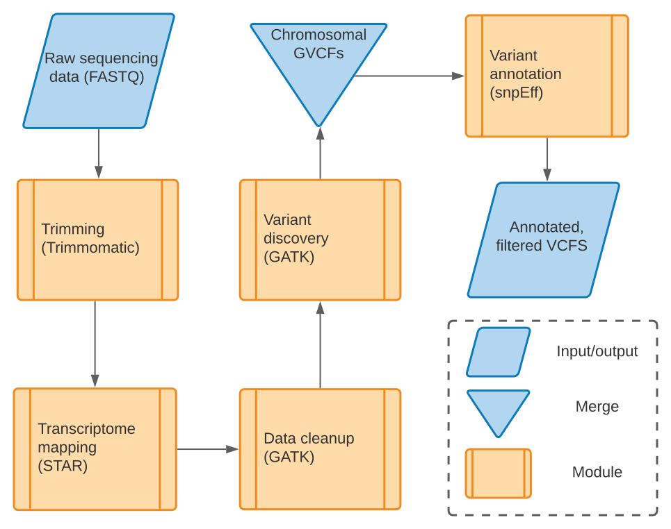

<h1>eurydice: RNA-seq variant calling (GATK)</h1>

**eurydice** is an RNA-seq pipeline that identifies SNPs and 
indels from raw sequencing data. The current implementation of
[GATK workflows for RNA-seq short variant discovery](https://gatk.broadinstitute.org/hc/en-us/articles/360035531192-RNAseq-short-variant-discovery-SNPs-Indels-)
workflows does not support the joint calling of RNA-seq to operate on a set of 
samples in parallel. This issue, compounded with inherently long runtimes for 
GATK tools such as
[HaplotypeCaller](https://gatk.broadinstitute.org/hc/en-us/articles/360037225632-HaplotypeCaller),
present a challenge in processing the data efficiently in terms of time and 
resources. **eurydice** was developed with consideration of GATK best practices 
for variant calling of RNA-seq data and to be scalable on both the sample- and 
chromosomal-level.
